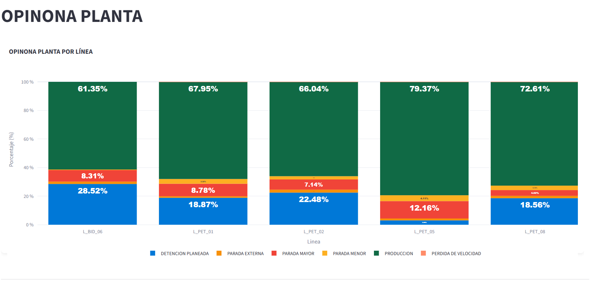
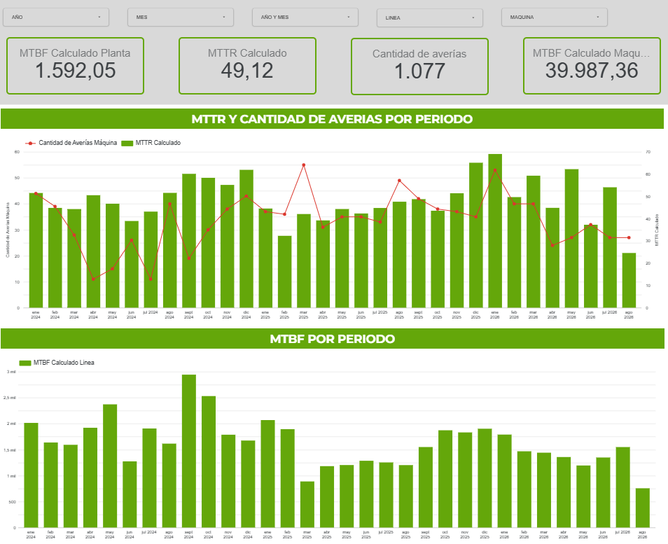

# Case Study: Dashboard de Seguimiento de Eficiencias y Paros (OEE)

## 📌 Resumen Ejecutivo
Diseño y desarrollo de un Dashboard analítico para el monitoreo detallado de la eficiencia productiva (OEE) y el análisis de causa raíz de los tiempos de paro en las líneas de producción.

## 🎯 El Problema
La gerencia de producción necesitaba una herramienta dinámica para entender exactamente dónde y por qué se perdía capacidad productiva. Los reportes estáticos no permitían profundizar (drill-down) en las causas específicas de las paradas de máquina.

## 💡 La Solución
Un dashboard interactivo que consolida los datos de producción y paradas, permitiendo una navegación desde una vista macro de la planta hasta el nivel más bajo (Nivel 4) del componente del equipo que causó el fallo.

### Arquitectura de Datos
1.  **Origen:** Descargas/Exportaciones desde SAP.
2.  **Base de Datos / Backend:** Google Sheets utilizado como repositorio central de los datos crudos.
3.  **Desarrollo Visual y Lógica:** Aplicación web desarrollada con **Streamlit (Python)**. Se utilizó Inteligencia Artificial (IA) para asistir en la generación del código de las visualizaciones y el procesamiento de datos.

## 🛠️ Características Principales

### 1. Dashboard de Eficiencia (Streamlit)
*   **Desglose Multinivel:** Capacidad de visualizar los tiempos de paro por:
    *   Sector -> Línea -> Máquina -> Componente (Nivel 1 al 4).
*   **Análisis Temporal:** Evolución de la eficiencia por período (Día, Semana, Mes, Turno).
*   **Clasificación de Paros:** Segmentación automática entre "Paros Mayores" (Averías) y "Micro-paros" (Ajustes rápidos).
*   **Pérdida de Eficiencia (Impacto):** Cálculo automático del porcentaje de impacto de cada equipo en la pérdida total de eficiencia de la línea.

### 2. Dashboard de Confiabilidad (Looker Studio)
*   **Métricas MTBF y MTTR:** Cálculo automatizado del Tiempo Medio Entre Fallas (MTBF) y el Tiempo Medio de Reparación (MTTR) a partir de los datos crudos de paros.
*   **Monitoreo de Activos:** Permite identificar rápidamente qué equipos fallan con mayor frecuencia o toman más tiempo en ser reparados.
*   **Sinergia de Datos:** Se alimenta de la **misma base de datos de Google Sheets** (exportada desde SAP) que el dashboard de eficiencia, maximizando el uso del dato sin esfuerzo de carga adicional.

## 📈 Impacto en el Negocio
*   **Toma de Decisiones Basada en Datos:** Permitió al equipo de Mantenimiento y Mejora Continua enfocar los recursos en el "Top 5" de equipos con mayor impacto negativo (Pareto).
*   **Estrategia de Mantenimiento:** La visibilidad del MTBF/MTTR permitió migrar recursos de mantenimientos basados en tiempo a mantenimientos basados en condición para los equipos más críticos.
*   **Ahorro de Tiempo:** Eliminación de horas de trabajo manual semanal dedicado a consolidar archivos de Excel para las reuniones de producción.
*   **Visibilidad de Micro-paros:** Sacó a la luz tiempos muertos "invisibles" que, sumados, representaban una pérdida significativa de eficiencia.

---
*Capturas de pantalla de los Dashboards*

