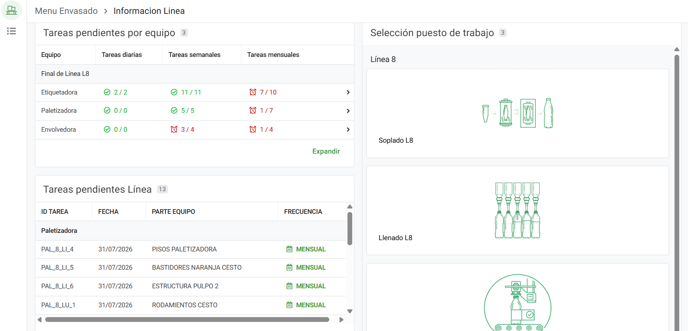
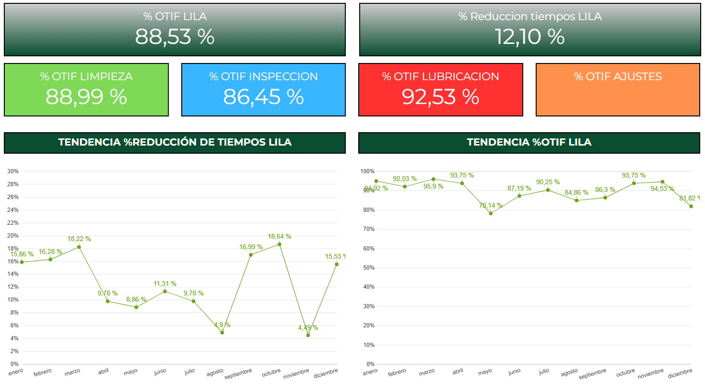

# Case Study: AppSheet LILA & Dashboard de Tareas Operativas

## 📌 Resumen Ejecutivo
Desarrollo de una solución end-to-end para digitalizar y monitorear la ejecución de tareas **LILA** (Limpieza, Inspección, Lubricación y Ajustes) por parte de los operadores de planta.

## 🎯 El Problema
Anteriormente, el registro de tareas de mantenimiento autónomo (LILA) se realizaba en papel o no se documentaba correctamente. Esto generaba:
*   Falta de visibilidad sobre el cumplimiento real de las tareas por turno.
*   Pérdida de información valiosa sobre anomalías detectadas en piso de planta.
*   Tiempos muertos en la consolidación de datos para la gerencia.

## 💡 La Solución
Se desarrolló una aplicación móvil intuitiva utilizando **AppSheet** para la captura de datos en tiempo real, conectada a un **Dashboard Interactivo** para la visualización y gestión por parte de los supervisores.

### Arquitectura de la Solución
1.  **Frontend (Captura):** AppSheet (Desplegada en dispositivos de los operadores).
2.  **Base de Datos:** [Google Sheets / SQL Database]
3.  **Visualización:** [Power BI / Tableau]

## 🛠️ Características Principales
*   **Registro de Tareas:** Los operadores seleccionan su turno, línea y marcan las tareas completadas.
*   **Time Tracking:** Registro del tiempo exacto de ejecución de cada tarea.
*   **Reporte de Anomalías:** Campo para ingresar observaciones, adjuntar fotografías de la anomalía y generar un nivel de prioridad.
*   **Dashboard de Control:** Vista gerencial para auditar el porcentaje de cumplimiento (LILA Score), tiempos promedios e incidentes reportados.

## 📈 Impacto en el Negocio
*   **100% Digitalización:** Eliminación completa del uso de papel para estos reportes.
*   **Aumento del Cumplimiento:** Mejora en el ratio de ejecución de tareas preventivas al tener visibilidad en tiempo real.
*   **Respuesta Temprana:** Reducción del tiempo de respuesta ante anomalías gracias a la carga de fotografías directamente desde la planta.

---
*Capturas de pantalla del Dashboard y la App (con datos ofuscados)*

