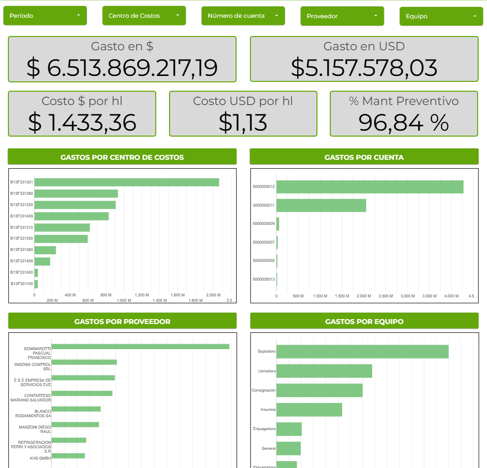

# Case Study: Dashboard de Seguimiento de Gastos de Mantenimiento

## 📌 Resumen Ejecutivo
Desarrollo de una herramienta analítica financiera para el departamento de mantenimiento, permitiendo el control presupuestario y el análisis detallado de los gastos operativos.

## 🎯 El Problema
El control de los gastos de mantenimiento (OPEX) se llevaba en hojas de cálculo pesadas y desconectadas de los sistemas transaccionales. Era difícil responder rápidamente a preguntas como: ¿Cuánto se gastó en mantenimientos correctivos versus preventivos este mes? ¿Qué línea de producción consume más presupuesto?

## 💡 La Solución
Un dashboard financiero interactivo en **Google Data Studio (Looker Studio)** que procesa la información extraída de SAP hacia **Google Sheets**, estructurándola en dimensiones de análisis para la toma de decisiones ágil.

## 🛠️ Características Principales
*   **Desglose de Costos:** Visualización del gasto por Sector y por Línea de Producción.
*   **Análisis por Naturaleza (Preventivo vs Correctivo):** KPI crucial para evaluar la madurez de la estrategia de mantenimiento. Un alto % correctivo indica problemas de confiabilidad.
*   **Análisis de Proveedores:** Ranking de proveedores por volumen de gasto y frecuencia.
*   **Seguimiento vs Presupuesto (Budget):** Comparativa del gasto real acumulado (YTD) versus el presupuesto asignado mensual y anual.

## 📈 Impacto en el Negocio
*   **Control Presupuestario:** Alertas tempranas de desviación del presupuesto, permitiendo frenar gastos no críticos.
*   **Optimización de Contratos:** La visibilidad del gasto por proveedor facilitó la renegociación de contratos de servicios frecuentes.
*   **Alineación Estratégica:** Evidenció la necesidad de migrar recursos hacia el mantenimiento preventivo al demostrar el alto costo de las reparaciones correctivas de emergencia.

---
*Capturas de pantalla del Dashboard (con datos ofuscados)*

