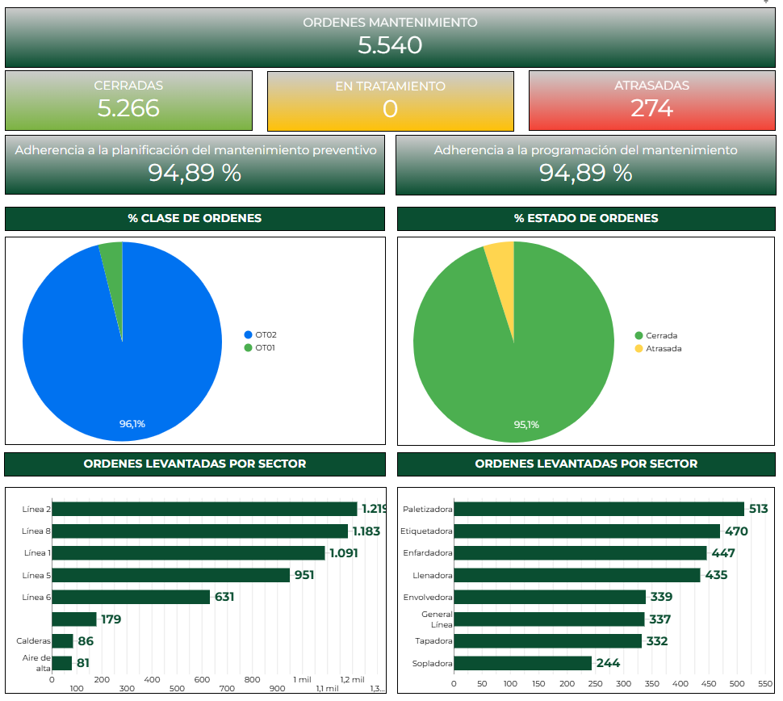

# Case Study: Dashboard de Cumplimiento de Órdenes de Mantenimiento

## 📌 Resumen Ejecutivo
Herramienta de visualización enfocada en la gestión operativa del equipo de mantenimiento, midiendo la carga de trabajo y el cumplimiento (Backlog y Schedule Compliance).

## 🎯 El Problema
Los planificadores de mantenimiento carecían de una visión clara sobre cuántas órdenes de trabajo (OTs) estaban abiertas, vencidas o completadas a tiempo. Esto generaba un backlog incontrolable y mantenimientos preventivos omitidos.

## 💡 La Solución
Un panel de control operativo desarrollado en **Google Data Studio (Looker Studio)** que extrae el estado de las órdenes del sistema ERP (SAP) a través de bases en **Google Sheets**, y muestra el rendimiento de los equipos técnicos de manera visual e interactiva.

## 🛠️ Características Principales
*   **Status de Órdenes:** Embudo de órdenes (Generadas -> Planificadas -> Ejecutadas -> Cerradas).
*   **Filtros Dinámicos:** Búsqueda rápida de OTs por Sector, Línea de Producción y Tipo de Mantenimiento.
*   **KPI de Cumplimiento:** Medición del % de Órdenes de Mantenimiento Preventivo completadas en la fecha planificada.
*   **Análisis de Backlog:** Visualización de horas de trabajo acumuladas pendientes de ejecución.

## 📈 Impacto en el Negocio
*   **Reducción del Backlog:** La visibilidad constante impulsó la reducción de órdenes atrasadas de más de 30 días en un X%.
*   **Mejora en la Planificación:** Facilitó las reuniones semanales de planificación entre Operaciones y Mantenimiento.
*   **Aumento de Confiabilidad:** Al asegurar la ejecución de las OTs preventivas, se contribuyó directamente a la reducción de paros de máquina (relacionado al [Dashboard de Eficiencia](./case-study-efficiency-tracking.md)).

---
*Capturas de pantalla del Dashboard*

