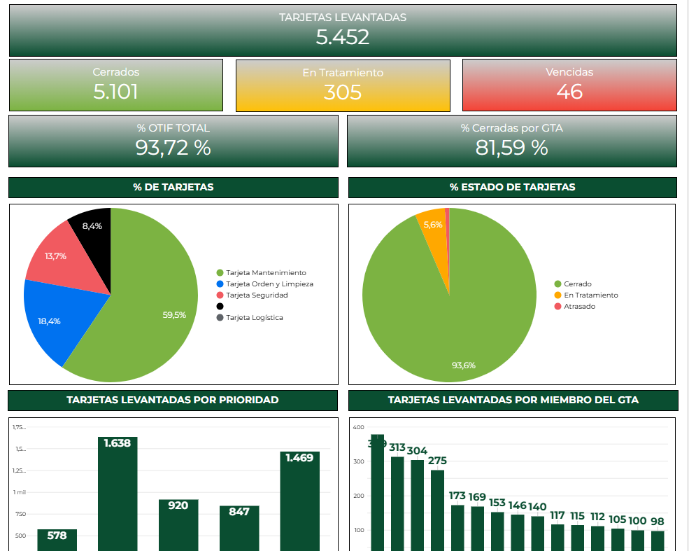

# Case Study: Dashboard de Resolución de Tarjetas SAP (OTIF)

## 📌 Resumen Ejecutivo
Implementación de un sistema visual para el seguimiento y gestión de "Tarjetas" (Avisos de Mantenimiento / Reportes de Anomalías) levantadas por los operadores de producción en SAP, enfocado en medir y mejorar el indicador OTIF (On Time In Full).

## 🎯 El Problema
Los operadores de las líneas de producción detectaban anomalías menores (ruidos, fugas leves, ajustes necesarios) y generaban "tarjetas" (Avisos) en SAP. Sin embargo:
*   Los responsables de mantenimiento no tenían una manera ágil de visualizar y priorizar estos avisos.
*   Las tarjetas quedaban olvidadadas, generando frustración en operaciones y escalando a problemas mayores.
*   No existía medición del tiempo de respuesta (Lead Time) ni del cumplimiento.

## 💡 La Solución
Desarrollo de un Dashboard de Gestión Visual en **Google Data Studio (Looker Studio)**. Este dashboard extrae los datos de Avisos de SAP (consolidados en **Google Sheets**), clasifica su criticidad y calcula automáticamente los indicadores de servicio para el departamento de mantenimiento.

## 🛠️ Características Principales
*   **Gestión Visual:** Tablero estilo Kanban / Lista priorizada de tarjetas abiertas, indicando los días transcurridos desde su creación.
*   **KPI OTIF (On Time In Full):** Medición del porcentaje de tarjetas que son resueltas dentro del SLA (Service Level Agreement) establecido (ej. menores a 7 días).
*   **Análisis de Cuellos de Botella:** Visualización de tarjetas por especialidad (Mecánica, Eléctrica, Instrumentación) para detectar dónde falta capacidad de resolución.
*   **Top Tarjetas Vencidas:** Alertas sobre las anomalías con mayor tiempo sin atención.

## 📈 Impacto en el Negocio
*   **Mejora de la Comunicación:** Sirvió como herramienta central en las reuniones diarias (Tier Meetings) entre Producción y Mantenimiento.
*   **Aumento del OTIF:** Incremento sustancial en la tasa de resolución a tiempo, pasando de un enfoque reactivo a uno gestionado.
*   **Empoderamiento del Operador:** Al ver que sus reportes eran gestionados y resueltos, aumentó la participación de los operadores en el cuidado básico de los equipos.

---
*Capturas de pantalla del Dashboard (con datos ofuscados)*

